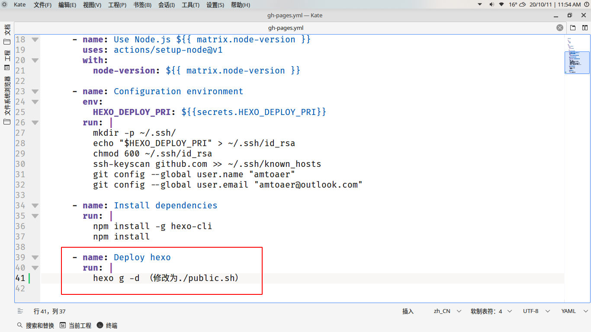
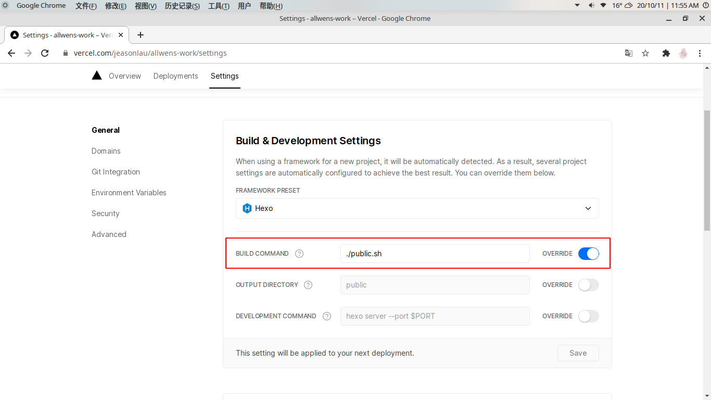
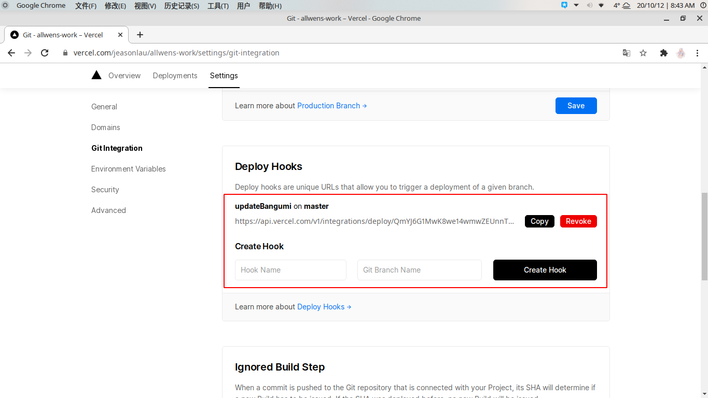

# AnimePage for hexo theme sakura

## 介绍

该程序用于为`hexo-theme-sakura`主题生成番组页面（使用`bangumi api`）

## 原理

通过`bangumi api`查看指定用户的收藏列表，将收藏列表中的特定条目按`hexo-theme-sakura`番组页的格式拼接起来，最后使用拼接完成的字符串替换当前目录下的`index.md`。

> 然而不知道为啥，`bangumi api`返回的`summary`（剧情简介）项为空。
>
> 为了获取剧情简介，我使用了`api`返回结果中的`id`请求了番组的网页详情，使用正则表达式进行了匹配。

## 用法

```bash
./GenerateAnimePage <username>
```

## 与hexo协作

因为没有用`node`开发，该程序不能像`hexo拓展`一样与`hexo`深度集成，目前的方案如下：

### 对于本地部署用户

> 本地部署比较麻烦，需要手动操作，推荐换成云端部署。

下载`release`中对应操作系统的版本（目前只编译了`linux`版），通过`./GenerateAnimePage <你的bangumi用户名>`

手动更新番组页面的`index.md`，接着使用`hexo g -d`部署。

### 对于云端部署用户（例如`github actions`、`Vercel`等）

参考[我的博客配置](https://github.com/amtoaer/allwens.work)，在博客根目录加入脚本（假设为博客根目录下的`public.sh`），内容如下：

```bash
#!/bin/bash

# 切换到番组目录（该目录是hexo theme sakura默认的番组文件夹，如果修改过文件夹名称需要在此对应修改）
cd source/bangumi
# 下载0.1.2版本的番组生成工具
curl -L -O https://github.com/amtoaer/AnimePage-for-hexo-theme-sakura/releases/download/0.1.2/GenerateAnimePage
# 给予可执行权限
chmod +x ./GenerateAnimePage
# 生成文件内容并覆盖本地番组的index.md（此处amtoaer是我自己的用户名，修改为自己的）
./GenerateAnimePage amtoaer
# 删除番组生成工具
rm ./GenerateAnimePage 
# 返回原目录
cd ../../ 
# hexo生成静态网页（填写原有的部署命令，github actions往往是hexo g -d，vercel是hexo g）
hexo generate
```

接着修改云端配置，将部署命令替换为`./public.sh`。

#### `github actions`



#### `vercel`



之后每次进行博客更新时，云端部署都会自动更新你的番组页面。

---

如果你需要在没有博客更新的情况下对番组界面进行单独更新，可以为`vercel`/(`github actions`)加入`hook`，通过访问特定链接触发自动构建，具体流程为：

+ vercel

  

+ github actions

  个人不太了解，请参考[官方文档](https://docs.github.com/en/free-pro-team@latest/actions/reference/events-that-trigger-workflows)。